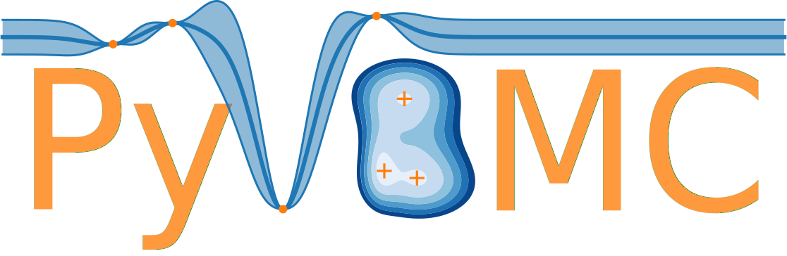

# PyVBMC: Variational Bayesian Monte Carlo in Python
### What is it?

PyVBMC is the port of the [MATLAB VBMC algorithm](https://github.com/lacerbi/vbmc) to Python. VBMC is an approximate inference method designed to fit and evaluate Bayesian models with a limited budget of potentially noisy likelihood evaluations (e.g., for computationally expensive models). Specifically, VBMC simultaneously computes:
- an approximate posterior distribution of the model parameters;
- an approximation — technically, an approximate lower bound — of the log model evidence (also known as log marginal likelihood or log Bayes factor), a metric used for [Bayesian model selection](https://en.wikipedia.org/wiki/Bayes_factor).

Extensive benchmarks on both artificial test problems and a large number of real model-fitting problems from computational and cognitive neuroscience show that VBMC generally — and often vastly — outperforms alternative methods for sample-efficient Bayesian inference [[1,2](#references-and-citation)].

### Documentation

The full documentation is available at: https://lacerbi.github.io/pyvbmc/

### When should I use PyVBMC?

PyVBMC is effective when:

- the model log-likelihood function is a black-box (e.g., the gradient is unavailable);
- the likelihood is at least moderately expensive to compute (say, half a second or more per evaluation);
- the model has up to `D = 10` continuous parameters (maybe a few more, but no more than `D = 20`);
- the target posterior distribution is continuous and reasonably smooth (see [here](https://github.com/lacerbi/vbmc/wiki#general));
- optionally, log-likelihood evaluations may be noisy (e.g., estimated [via simulation](https://github.com/lacerbi/ibs)).

Conversely, if your model can be written analytically, you should exploit the powerful machinery of probabilistic programming frameworks such as [Stan](http://mc-stan.org/) or [PyMC3](https://docs.pymc.io/).

## Installation

PyVBMC is not yet available on `pip`/`conda-forge`, but can be installed in a few steps:

1. Clone the `pyvbmc` and `gpyreg` GitHub repos locally:
   ```console
   git clone https://github.com/lacerbi/pyvbmc
   git clone https://github.com/lacerbi/gpyreg
   ```
   (PyVBMC depends on [`gpyreg`](https://github.com/lacerbi/gpyreg), which is a package for lightweight Gaussian process regression in Python.)
2. (Optional) Create a new environment in `conda` and activate it. We recommend using Python 3.9 or newer, but older versions *might* work:
   ```console
   conda create --name pyvbmc-env python=3.9
   conda activate pyvbmc-env
   ```
3. Install the repos:
   ```console
   cd ./gpyreg
   pip install -e .
   cd ../pyvbmc
   pip install -e .
   ```
4. Install `jupyter` to view the examples (you can skip this step if you're working from a `conda` environment which already has `jupyter`):
   ```console
   conda install jupyter
   ```

## Quick start
The typical usage pipeline of pyvbmc follows four steps:

1. Define the model, which defines a target log density (i.e., an unnormalized log posterior density);
2. Setup the parameters (parameter bounds, starting point);
3. Initialize and run the inference;
4. Examine and visualize the results.

PyVBMC is not concerned with how you define your model in step 1, as long as you can provide an (unnormalized) target log density. Running the inference in step 3 only involves a couple of lines of code:
```python
from pyvbmc.vbmc import VBMC
# ... define your model/target density here
vbmc = VBMC(target, x0, LB, UB, PLB, PUB)
vp, elbo, elbo_sd, _, _ = vbmc.optimize()
```
with input arguments:
- `target`: the target (unnormalized) log density — often an unnormalized log posterior. target takes as input a parameter vector and returns the log density at the point;
- `x0`: an array representing the starting point of the inference in parameter space;
- `LB` and `UB`: an array of hard lower and upper bounds constraining the parameters (possibly infinite);
- `PLB` and `PUB`: an array of plausible lower and upper bounds: that is, a box that ideally brackets a high density region of the target.

The outputs are:
- `vp`: a VariationalPosterior object which approximates the true target density;
- `elbo`: the estimated lower bound on the log model evidence (log normalization constant);
- `elbo_sd`: the standard deviation of the estimate of the ELBO (not the error between the ELBO and the true log model evidence, which is generally unknown).

The vp object can be manipulated in various ways, see the [`VariationalPosterior` class documentation](https://lacerbi.github.io/pyvbmc/api/classes/variational_posterior.html).

## Next steps

Once installed, example Jupyter notebooks can be found in the `pyvbmc/examples` directory. They can also be [viewed statically](https://lacerbi.github.io/pyvbmc/index.html#examples) on the [main documentation pages](https://lacerbi.github.io/pyvbmc/index.html). These examples will walk you through the basic usage of PyVBMC as well as some if its more advanced features.

For practical recommendations, such as how to set `LB` and `UB` and the plausible bounds, check out the FAQ on the [VBMC wiki](https://github.com/lacerbi/vbmc/wiki). The wiki was written with the MATLAB toolbox in mind, but the general advice applies to the Python version as well.

## Troubleshooting and contact

PyVBMC is under active development. The original VBMC algorithm has been extensively tested in several benchmarks and published papers, and the benchmarks have been replicated using PyVBMC. But as with any approximate inference technique, you should double-check your results. See the [examples](https://lacerbi.github.io/pyvbmc/index.html#examples) for descriptions of the convergence diagnostics and suggestions on validating PyVBMC's results with multiple runs.

If you have trouble doing something with PyVBMC, spot bugs or strange behavior, or you simply have some questions, please feel free to:
- [open an issue](https://github.com/lacerbi/pyvbmc/issues/new) on GitHub, or,
- contact me at <luigi.acerbi@helsinki.fi>, putting 'PyVBMC' in the subject of the email.

## References and citation

1. Acerbi, L. (2018). Variational Bayesian Monte Carlo. In *Advances in Neural Information Processing Systems 31*: 8222-8232. ([paper + supplement on arXiv](https://arxiv.org/abs/1810.05558), [NeurIPS Proceedings](https://papers.nips.cc/paper/8043-variational-bayesian-monte-carlo))
2. Acerbi, L. (2020). Variational Bayesian Monte Carlo with Noisy Likelihoods. In *Advances in Neural Information Processing Systems 33*: 8211-8222 ([paper + supplement on arXiv](https://arxiv.org/abs/2006.08655), [NeurIPS Proceedings](https://papers.nips.cc/paper/2020/hash/5d40954183d62a82257835477ccad3d2-Abstract.html)).

Please cite both references if you use PyVBMC in your work (the 2018 paper introduced the framework, and the 2020 paper includes a number of major improvements, including but not limited to support for noisy likelihoods). You can cite PyVBMC in your work with something along the lines of

> We estimated approximate posterior distibutions and approximate lower bounds to the model evidence of our models using Variational Bayesian Monte Carlo (PyVBMC; Acerbi, 2018, 2020). PyVBMC combines variational inference and active-sampling Bayesian quadrature to perform approximate Bayesian inference in a sample-efficient manner.

Besides formal citations, you can demonstrate your appreciation for PyVBMC in the following ways:

- *Star :star:* the VBMC repository on GitHub;
- [Follow Luigi Acerbi on Twitter](https://twitter.com/AcerbiLuigi) for updates about VBMC/PyVBMC and other projects I am involved with;
- Tell us about your model-fitting problem and your experience with PyVBMC (positive or negative) at <luigi.acerbi@helsinki.fi> (putting  'PyVBMC' in the subject of the email).

You may also want to check out [Bayesian Adaptive Direct Search](https://github.com/lacerbi/bads) (BADS), our method for fast Bayesian optimization. Currently available only in MATLAB, but a Python version is in development.

### Additional references

3. Acerbi, L. (2019). An Exploration of Acquisition and Mean Functions in Variational Bayesian Monte Carlo. In *Proc. Machine Learning Research* 96: 1-10. 1st Symposium on Advances in Approximate Bayesian Inference, Montréal, Canada. ([paper in PMLR](http://proceedings.mlr.press/v96/acerbi19a.html))

### BibTeX

```BibTeX
@inproceedings{NEURIPS2018_747c1bcc,
 author = {Acerbi, Luigi},
 booktitle = {Advances in Neural Information Processing Systems},
 editor = {S. Bengio and H. Wallach and H. Larochelle and K. Grauman and N. Cesa-Bianchi and R. Garnett},
 pages = {},
 publisher = {Curran Associates, Inc.},
 title = {Variational Bayesian Monte Carlo},
 url = {https://proceedings.neurips.cc/paper/2018/file/747c1bcceb6109a4ef936bc70cfe67de-Paper.pdf},
 volume = {31},
 year = {2018}
}
@inproceedings{NEURIPS2020_5d409541,
 author = {Acerbi, Luigi},
 booktitle = {Advances in Neural Information Processing Systems},
 editor = {H. Larochelle and M. Ranzato and R. Hadsell and M.F. Balcan and H. Lin},
 pages = {8211--8222},
 publisher = {Curran Associates, Inc.},
 title = {Variational Bayesian Monte Carlo with Noisy Likelihoods},
 url = {https://proceedings.neurips.cc/paper/2020/file/5d40954183d62a82257835477ccad3d2-Paper.pdf},
 volume = {33},
 year = {2020}
}
@InProceedings{pmlr-v96-acerbi19a,
  title = 	 {An Exploration of Acquisition and Mean Functions
 in Variational Bayesian Monte Carlo},
  author =       {Acerbi, Luigi},
  booktitle = 	 {Proceedings of The 1st Symposium on Advances in Approximate Bayesian Inference},
  pages = 	 {1--10},
  year = 	 {2019},
  editor = 	 {Ruiz, Francisco and Zhang, Cheng and Liang, Dawen and Bui, Thang},
  volume = 	 {96},
  series = 	 {Proceedings of Machine Learning Research},
  month = 	 {02 Dec},
  publisher =    {PMLR},
  pdf = 	 {http://proceedings.mlr.press/v96/acerbi19a/acerbi19a.pdf},
  url = 	 {https://proceedings.mlr.press/v96/acerbi19a.html}
}
```

### Acknowledgments

PyVBMC was developed from the original MATLAB toolbox by [members](https://www.helsinki.fi/en/researchgroups/machine-and-human-intelligence/people) (past and current) of the [Machine and Human Intelligence Lab](https://www.helsinki.fi/en/researchgroups/machine-and-human-intelligence/) at the University of Helsinki. The ongoing Python port is being supported by the Academy of Finland Flagship programme: [Finnish Centre for Artificial Intelligence (FCAI)](https://fcai.fi/).

### License

PyVBMC is released under the terms of the [BSD 3-Clause License](https://github.com/lacerbi/pyvbmc/blob/main/LICENSE).
