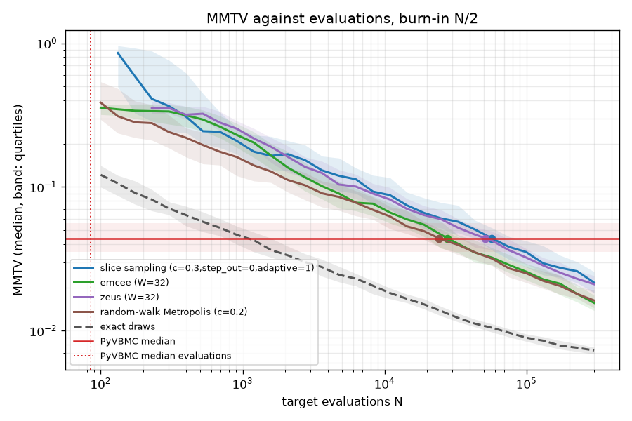
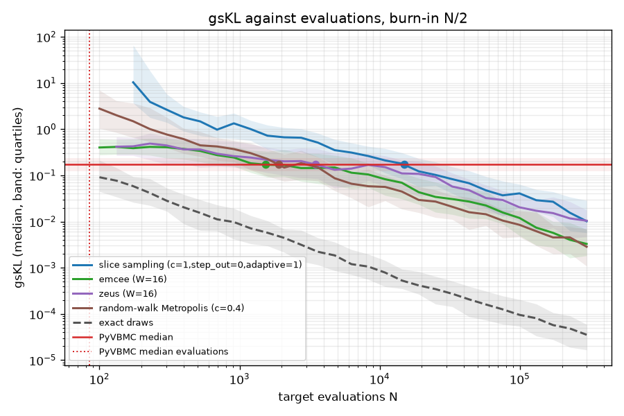

# Evaluations that MCMC needs to match PyVBMC on the banana

On the two-dimensional banana that the animation plays
(`export_animation_trace.py --target banana`), a typical PyVBMC run reaches
its posterior in a median of 85 target evaluations. To reach the same
accuracy by MMTV (the mean marginal total variation distance to the true
posterior), the fastest of three well-tuned black-box MCMC samplers,
emcee's ensemble with 32 walkers, needs a median of **27,828 evaluations**
(90% bootstrap interval 23,098 to 31,764, from 100 replicates against 100
PyVBMC runs). That is about 330 times as many. Slice sampling needs about
57,000 and zeus about 51,000. MCMC gives no estimate of the model
evidence, which PyVBMC returns from the same evaluations (with a median
error of 0.045 nats here).

A claim that cites the number reads: "On this posterior, emcee, a
black-box MCMC sampler, needs a median of about 28,000 evaluations (90%
interval 23,000 to 32,000; 100 runs each) to match the MMTV of a typical
PyVBMC run, which uses 85. MCMC gives no evidence estimate." The number
holds for this target and this setup, which is generous to MCMC in the
ways that "Method" lists.

The comparison follows
[plans/matched-mcmc-budget.md](../plans/matched-mcmc-budget.md), whose
worklog records the runs. Everything quoted here is in
[`report.md`](../experiments/matched_mcmc_budget_20260930/report.md) and
[`summary.json`](../experiments/matched_mcmc_budget_20260930/summary.json)
of `dev/experiments/matched_mcmc_budget_20260930/`. That directory holds
every file that `matched_mcmc_budget.py report` reads, and the report
reruns from it unchanged.

## Method

- **Target.** The exporter's banana: `x0 = (-3, 5.5)`, plausible box
  `(-5, -3.5)` to `(5, 7.5)`, no bounds. PyVBMC runs through the
  exporter's own `run(seed, 200)`, the budget being its default of
  `50 (D + 2)`. The truth and the samplers' log density are those of the
  benchmark's `banana` at `D = 2` (`sig1 = 2`, `b = 0.5`), which agrees
  with the exporter's density to a relative 2.2e-16.
- **The reference.** PyVBMC on seeds 0 to 99, every run kept. The
  reference accuracy of a metric is its median over the runs.
- **The samplers.** Slice sampling (`gpyreg`'s `SliceSampler`, the one
  PyVBMC itself uses), emcee (stretch move), zeus (ensemble slice
  sampling), and random-walk Metropolis for comparison, outside the
  headline. Each gets the log density, the start point (slice sampling
  and Metropolis) or walkers drawn uniformly in the plausible box (the
  ensembles), and the plausible box, which sets its scales. Every
  evaluated point counts: the walkers' initial evaluations, the stepping
  out and shrinking of the slice samplers, and the adaptation sweeps.
- **Tuning.** A pilot on seeds 1000 to 1009 picked, for each sampler and
  each metric, the setting of a grid with the smallest matched budget.
  The grid has 12 settings for slice sampling (width factor, stepping
  out, adaptation) and 4 for each of the others (walkers, or step size).
  The pilot's evaluations are not counted.
- **Budgets.** Each replicate is one chain of up to 3 × 10^5 evaluations.
  Its prefixes are the runs of 30 budgets spaced evenly in log N from 100.
  At budget N, the states reached by evaluation N count, less those
  reached within the first N / 2 evaluations (burn-in).
- **Metrics.** gsKL and MMTV as `benchmark_targets.py` computes them,
  against the same 10^5 exact draws for PyVBMC and for the samplers.
- **The matched budget** `N*` is the smallest budget at which the median
  error over the replicates falls to PyVBMC's median, interpolated in log
  N and log error. Its interval is the 5th to 95th percentile over 1000
  bootstrap resamples of both sides, unpaired, because every replicate
  of this configuration starts from the same `x0`. The headline is the
  smallest MMTV `N*` over the three black-box samplers, and its interval
  takes that minimum inside each resample.

This setup is generous to MCMC. Each sampler is tuned for the metric it
is scored on, the tuning costs nothing, and the headline takes the best of
three samplers. PyVBMC runs with its defaults.

## The reference

100 runs, none raised.

| Quantity | 25% | Median | 75% |
|---|---|---|---|
| evaluations | 80 | 85 | 90 |
| gsKL | 0.121 | 0.171 | 0.236 |
| MMTV | 0.0352 | 0.0440 | 0.0558 |
| evidence error, \|ELBO − ln Z\| | 0.0349 | 0.0454 | 0.0626 |

## The matched budget

100 replicates of each setting; no run raised. The interval is 90%.

| Sampler | MMTV setting | MMTV `N*` | Interval | gsKL setting | gsKL `N*` | Interval |
|---|---|---|---|---|---|---|
| slice sampling | `c=0.3`, no step-out, adaptive | 56,902 | 47,246 to 65,988 | `c=1`, no step-out, adaptive | 14,916 | 10,885 to 18,024 |
| **emcee** | **`W=32`** | **27,828** | **23,098 to 31,764** | `W=16` | 1,530 | 1,065 to 3,114 |
| zeus | `W=32` | 51,317 | 39,088 to 61,217 | `W=16` | 3,498 | 1,530 to 4,642 |
| random-walk Metropolis | `c=0.2` | 24,134 | 19,365 to 30,327 | `c=0.4` | 1,896 | 1,735 to 3,504 |

For slice sampling and Metropolis, `c` scales the widths or the proposal
standard deviations to `c` times the plausible box. emcee is the fastest
black-box sampler on MMTV in every resample, so the headline's interval
equals its own.

- **gsKL flatters MCMC.** It compares only the first two moments. The
  banana's true covariance is diagonal, so a sampler matches gsKL once it
  has the means and the marginal variances, before it has explored the
  ridge. emcee matches PyVBMC's gsKL at about 1,500 evaluations and its
  MMTV at about 28,000, 18 times later; for zeus the factor is 15, for
  slice sampling 4. The headline therefore uses MMTV alone.
- **Random-walk Metropolis keeps up.** Tuned, it matches PyVBMC's MMTV at
  about 24,000 evaluations, level with emcee within the intervals: in two
  dimensions a well-scaled random walk is competitive. By the plan's
  definition it is shown for comparison and does not enter the headline.
- **The floor.** Exact independent draws, `N / 2` of them at budget N,
  reach PyVBMC's MMTV at N = 1,084, that is with 542 draws. No sampler
  can do better under this burn-in rule. The black-box samplers need 25
  to 50 times that, mostly the cost of the correlation between their
  states. By
  gsKL, exact draws beat PyVBMC at the smallest budget (50 draws).
- **Burn-in.** With the first 10% or 25% of each budget discarded instead
  of half, emcee's MMTV `N*` is 17,641 or 20,395. The other samplers' fall
  by about the same factors (the table of `report.md` gives all of them).

## Error curves

The median error of each sampler at its chosen setting against the
budget, with the quartiles as a band. The horizontal line is PyVBMC's
median error with its quartiles, the dotted vertical line PyVBMC's median
number of evaluations, and the dashed curve the exact draws.

## Settings tried

Pilot `N*` on seeds 1000 to 1009 against the reference medians; the
chosen settings are in bold. On 10 seeds a pilot `N*` is noisy: slice
sampling's chosen MMTV setting read 33,306 in the pilot and 56,902 on the
replicates.

| Sampler | Setting | gsKL `N*` | MMTV `N*` |
|---|---|---|---|
| slice sampling | `c=0.1`, no step-out, fixed | 56,050 | 247,579 |
| | `c=0.1`, no step-out, adaptive | 19,677 | 66,415 |
| | `c=0.1`, step-out, fixed | 24,074 | 112,468 |
| | `c=0.1`, step-out, adaptive | 16,296 | 96,474 |
| | `c=0.3`, no step-out, fixed | 10,058 | 83,594 |
| | `c=0.3`, no step-out, adaptive | 9,043 | **33,306** |
| | `c=0.3`, step-out, fixed | 17,210 | 75,884 |
| | `c=0.3`, step-out, adaptive | 28,620 | 85,102 |
| | `c=1`, no step-out, fixed | 10,873 | 42,040 |
| | `c=1`, no step-out, adaptive | **6,006** | 48,340 |
| | `c=1`, step-out, fixed | 11,865 | 84,698 |
| | `c=1`, step-out, adaptive | 30,390 | 71,777 |
| emcee | `W=4` | 9,731 | 44,354 |
| | `W=8` | 1,619 | 43,983 |
| | `W=16` | **639** | 34,660 |
| | `W=32` | 1,403 | **33,640** |
| zeus | `W=4` | 7,744 | 105,007 |
| | `W=8` | 10,678 | 51,228 |
| | `W=16` | **1,368** | 46,534 |
| | `W=32` | 1,952 | **42,242** |
| random-walk Metropolis | `c=0.05` | 31,235 | 88,801 |
| | `c=0.1` | 8,218 | 33,824 |
| | `c=0.2` | 6,300 | **26,140** |
| | `c=0.4` | **996** | 33,283 |

"Adaptive" slice sampling adapts its widths over 20 sweeps whose
evaluations count and whose states are discarded.

## Checks

- **Before the runs**, `check --config exporter` passed all 70 checks at
  `159237c` (its log is `check.log` in the experiments directory). The
  tool's PyVBMC runs of seeds 0 to 4 reproduce the exporter's `--sweep
  0:5` on the executing machine, evaluation for evaluation and in the
  exporter's gsKL to the digits printed. Each sampler's own count of
  evaluations equals the wrapper's (for zeus, `ncall` plus the initial
  walkers, which `ncall` leaves out), every state of the slice sampler is
  in its evaluation log, a chain of half the length is a prefix of the
  full one, and the tool's metrics equal `sample_metrics` bit for bit.
- **After the runs**, every sampler's median error at 3 × 10^5 lies below
  the reference by both metrics, so no run needed the extension to 3 ×
  10^6. No run raised, on either side.

## For the video

At three minutes an evaluation, the headline's 27,828 evaluations take
about 58 days, a little over eight weeks, against about four hours for
PyVBMC's 85.

## Platform

A cloud container: Linux x86_64 (kernel 6.18), 4 CPUs (Intel Xeon at
2.10 GHz), Python 3.12.3, PyVBMC from the checkout (its package code
that of `dev-next` at `695385e`; this work changes only `dev/`), gpyreg
1.4.0, NumPy 2.5.3, SciPy 1.18.1, emcee 3.1.6, zeus-mcmc 2.5.4, with BLAS single-threaded and four
processes at a time. The reference took 8 minutes, the pilot 22 and the
replicates 66. Each output directory's `invocations.jsonl` records the
commit, versions and wall time of every invocation. A PyVBMC run
reproduces only on the platform that made it, so the reference is this
platform's.
