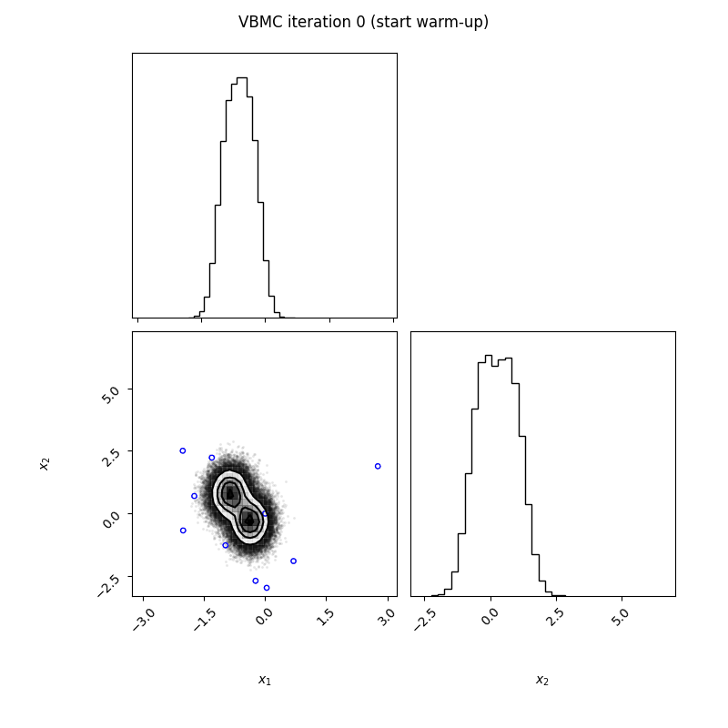

******
PyVBMC
******
Variational Bayesian Monte Carlo (VBMC) is an approximate inference method designed to fit and evaluate computational models with a limited budget of potentially noisy likelihood evaluations, useful for computationally expensive models or for quick inference and model evaluation (Acerbi, 2018; 2020).

VBMC simultaneously computes:

- an approximate posterior distribution of the model parameters;

- an approximation — technically, an approximate lower bound — of the log model evidence (also known as log marginal likelihood or log Bayes factor), a metric used for Bayesian model selection.

Extensive benchmarks on both artificial test problems and a large number of real model-fitting problems from computational and cognitive neuroscience show that VBMC generally — and often vastly — outperforms alternative methods for sample-efficient Bayesian inference. VBMC runs with virtually no tuning and it is very easy to set up for your problem.

``pyvbmc`` is a numerical Python 3.x implementation of the VBMC algorithm, licensed under `BSD3 <https://opensource.org/licenses/BSD-3-Clause>`_. 
The Python source is on `GitHub <https://github.com/lacerbi/pyvbmc>`_.
You may also want to check out the original `MATLAB toolbox <https://github.com/lacerbi/vbmc>`_.

.. note::
    This project is work in progress. The current Python port implements VBMC with *exact* evaluations of the likelihood (Acerbi, 2018). We are currently planning to extend ``pyvbmc`` to support *noisy* likelihood evaluations, such as those arising from simulator-based models (Acerbi, 2020).

Documentation
#############
.. toctree::
   :maxdepth: 1
   :titlesonly:

   installation
   api/classes/variational_posterior
   api/classes/vbmc
   api/advanced_docs

Examples
########
.. toctree::
   :maxdepth: 1
   :titlesonly:
   :glob:

   _examples/*

References
###############

1. Acerbi, L. (2018). Variational Bayesian Monte Carlo. In *Advances in Neural Information Processing Systems 31*: 8222-8232. (`paper + supplement on arXiv <https://arxiv.org/abs/1810.05558>`_, `NeurIPS Proceedings <https://papers.nips.cc/paper/2018/hash/747c1bcceb6109a4ef936bc70cfe67de-Abstract.html>`_)
2. Acerbi, L. (2020). Variational Bayesian Monte Carlo with Noisy Likelihoods. In *Advances in Neural Information Processing Systems 33*: 8211-8222 (`paper + supplement on arXiv <https://arxiv.org/abs/2006.08655>`_, `NeurIPS Proceedings <https://papers.nips.cc/paper/2020/hash/5d40954183d62a82257835477ccad3d2-Abstract.html>`_).

You can cite VBMC in your work with something along the lines of

*We estimated approximate posterior distibutions and approximate lower bounds to the model evidence of our models using Variational Bayesian Monte Carlo (VBMC; Acerbi, 2018, 2020). VBMC combines variational inference and active-sampling Bayesian quadrature to perform approximate Bayesian inference in a sample-efficient manner.*

Acknowledgments
###############
Work on the ``pyvbmc`` package was funded by the `Finnish Center for Artificial Intelligence FCAI <https://fcai.fi/>`_.
