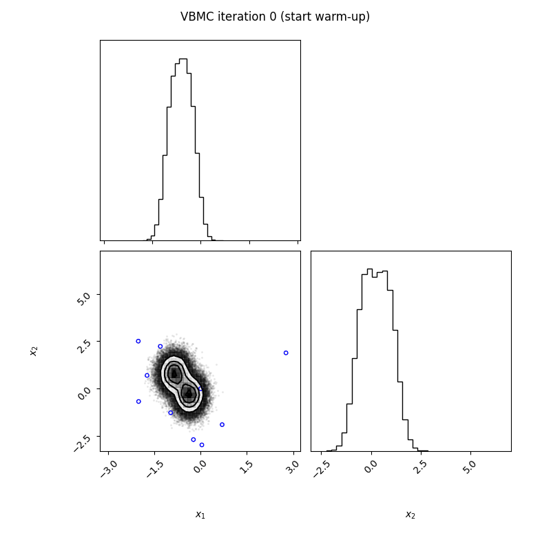

******
PyVBMC
******

PyVBMC is a Python implementation of the Variational Bayesian Monte Carlo (VBMC) algorithm for posterior and model inference, previously implemented :labrepos:`in MATLAB <vbmc>`.

What is it?
###########

  Can we perform Bayesian inference with expensive, black-box models?

VBMC is an approximate Bayesian inference method designed to fit computational models with a limited budget of potentially noisy likelihood evaluations, useful for computationally expensive models or for quick inference and model evaluation `(Acerbi, 2018; 2020) <#references>`_.
PyVBMC works with *black-box* models in that it only needs to evaluate an unnormalized target log density (e.g., an unnormalized target log posterior).

PyVBMC simultaneously computes:

- an approximate posterior distribution of the model parameters;

- an approximation — technically, an approximate lower bound — of the log model evidence (also known as log marginal likelihood), a metric used for Bayesian model selection.

Example run
-----------

The figure below shows an example PyVBMC run on a "banana" target density.
The corner plot shows the approximate posterior across iterations (contour plot and histograms of the marginals).
The dots represent evaluations of the target density (*blue*: previously sampled points, *green*: points sampled in the current iteration).
PyVBMC converges to an excellent approximation of the true posterior with a few dozen evaluations of the target density.

Extensive benchmarks on both artificial test problems and a large number of real model-fitting problems from computational and cognitive neuroscience show that VBMC generally — and often vastly — outperforms alternative methods for sample-efficient Bayesian inference. VBMC runs with virtually no tuning and it is very easy to set up for your problem.

Should I use PyVBMC?
--------------------

PyVBMC is effective when:

- the model log-likelihood function is a black-box (e.g., the gradient is unavailable);
- the likelihood is at least moderately expensive to compute (say, half a second or more per evaluation);
- the model has up to ``D = 10`` continuous parameters (maybe a few more, but no more than ``D = 20``);
- the target posterior density is continuous and reasonably smooth;
- optionally, log-likelihood evaluations may be noisy (see the :ref:`FAQ <faq-noisy-target-function>`).

Conversely, if your model can be written in closed form and is fast to evaluate, you should exploit the powerful machinery of probabilistic programming frameworks such as `Stan <https://mc-stan.org/>`_ or `PyMC <https://www.pymc.io/>`_.

Note: If you are interested in point estimates or in finding better starting points for PyVBMC, check out :labrepos:`Bayesian Adaptive Direct Search in Python (PyBADS) <pybads>`, our companion method for fast Bayesian optimization.

How-to
######

Start with the :doc:`quickstart` and :doc:`examples`, and consult the
:doc:`FAQ <faq>` for practical advice on setting up and validating a run.
The quickstart also covers reproducibility, vectorized targets and exporting
a fitted posterior to Torch or ArviZ. To combine the posteriors of several
runs on the same model and data without further model evaluations, see
:doc:`S-VBMC <api/classes/svbmc>` (`Silvestrin et al., 2025 <https://arxiv.org/abs/2504.05004>`__) and
:ref:`PyVBMC Example 7: Stacking the posteriors of several runs (S-VBMC)`.

.. toctree::
   :maxdepth: 2
   :titlesonly:

   installation
   quickstart
   faq
   examples
   documentation

For coding agents, the :mainbranch:`PyVBMC skill <skills/pyvbmc/SKILL.md>`
points to the documentation relevant to each task. Give your agent that
file, or copy the ``skills/pyvbmc`` folder into its skill directory.

Contributing
############
.. toctree::
   :maxdepth: 1
   :titlesonly:

   development

References
###############

1. Huggins, B., Li, C., Tobaben, M., Aarnos, M., & Acerbi, L. (2023). `PyVBMC: Efficient Bayesian inference in Python <https://joss.theoj.org/papers/10.21105/joss.05428>`__. *Journal of Open Source Software* 8(86), 5428, https://doi.org/10.21105/joss.05428.
2. Acerbi, L. (2018). Variational Bayesian Monte Carlo. In *Advances in Neural Information Processing Systems 31*: 8222-8232. (`paper + supplement on arXiv <https://arxiv.org/abs/1810.05558>`__, `NeurIPS Proceedings <https://papers.nips.cc/paper/2018/hash/747c1bcceb6109a4ef936bc70cfe67de-Abstract.html>`__)
3. Acerbi, L. (2020). Variational Bayesian Monte Carlo with Noisy Likelihoods. In *Advances in Neural Information Processing Systems 33*: 8211-8222 (`paper + supplement on arXiv <https://arxiv.org/abs/2006.08655>`__, `NeurIPS Proceedings <https://papers.nips.cc/paper/2020/hash/5d40954183d62a82257835477ccad3d2-Abstract.html>`__).
4. Silvestrin, F., Li, C., & Acerbi, L. (2025). Stacking Variational Bayesian Monte Carlo. *Transactions on Machine Learning Research*. (`paper + supplement on arXiv <https://arxiv.org/abs/2504.05004>`__, `TMLR <https://openreview.net/forum?id=M2ilYAJdPe>`__)

Please cite the first three references when using PyVBMC, and also
Silvestrin et al. (2025) when using S-VBMC.

You can cite PyVBMC in your work with something along the lines of

    We estimated approximate posterior distributions and approximate lower bounds to the model evidence of our models using Variational Bayesian Monte Carlo (VBMC; Acerbi, 2018, 2020) via the PyVBMC software (Huggins et al., 2023). PyVBMC combines variational inference and active-sampling Bayesian quadrature to perform approximate Bayesian inference in a sample-efficient manner.

If you use S-VBMC, please also add a sentence such as:

    Posteriors from multiple PyVBMC runs on the same model and dataset were combined using S-VBMC (Silvestrin et al., 2025), which often improves the approximation to the true posterior by leveraging information from independent runs.

BibTeX
------
::

  @article{huggins2023pyvbmc,
    title = {PyVBMC: Efficient Bayesian inference in Python},
    author = {Bobby Huggins and Chengkun Li and Marlon Tobaben and Mikko J. Aarnos and Luigi Acerbi},
    publisher = {The Open Journal},
    journal = {Journal of Open Source Software},
    url = {https://doi.org/10.21105/joss.05428},
    doi = {10.21105/joss.05428},
    year = {2023},
    volume = {8},
    number = {86},
    pages = {5428}
  }

  @article{acerbi2018variational,
    title={{V}ariational {B}ayesian {M}onte {C}arlo},
    author={Acerbi, Luigi},
    journal={Advances in Neural Information Processing Systems},
    volume={31},
    pages={8222--8232},
    year={2018}
  }

  @article{acerbi2020variational,
    title={{V}ariational {B}ayesian {M}onte {C}arlo with noisy likelihoods},
    author={Acerbi, Luigi},
    journal={Advances in Neural Information Processing Systems},
    volume={33},
    pages={8211--8222},
    year={2020}
  }

  @article{silvestrin2025stacking,
    title={Stacking {V}ariational {B}ayesian {M}onte {C}arlo},
    author={Silvestrin, Francesco and Li, Chengkun and Acerbi, Luigi},
    journal={Transactions on Machine Learning Research},
    year={2025},
    url={https://openreview.net/forum?id=M2ilYAJdPe}
  }

  @article{acerbi2019exploration,
    title={An Exploration of Acquisition and Mean Functions in {V}ariational {B}ayesian {M}onte {C}arlo},
    author={Acerbi, Luigi},
    journal={PMLR},
    volume={96},
    pages={1--10},
    year={2019}
  }

License and source
------------------

PyVBMC is released under the terms of the :mainbranch:`BSD 3-Clause License <LICENSE>`.
The Python source code is on :labrepos:`GitHub <pyvbmc>`.

Acknowledgments:
################

PyVBMC was developed by `members <https://www.helsinki.fi/en/researchgroups/machine-and-human-intelligence/people>`_ (past and current) of the `Machine and Human Intelligence Lab <https://www.helsinki.fi/en/researchgroups/machine-and-human-intelligence/>`_ at the University of Helsinki and `ELLIS Institute Finland <https://www.ellisinstitute.fi/>`_. Work on the PyVBMC package is supported by the Research Council of Finland (grants 356498 and 358980 to Luigi Acerbi) and its Flagship programme: `Finnish Center for Artificial Intelligence FCAI <https://fcai.fi/>`_.

.. toctree::
   :maxdepth: 1
   :titlesonly:
   :hidden:

   about_us
